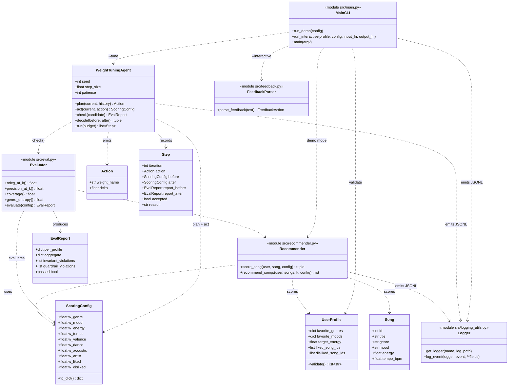
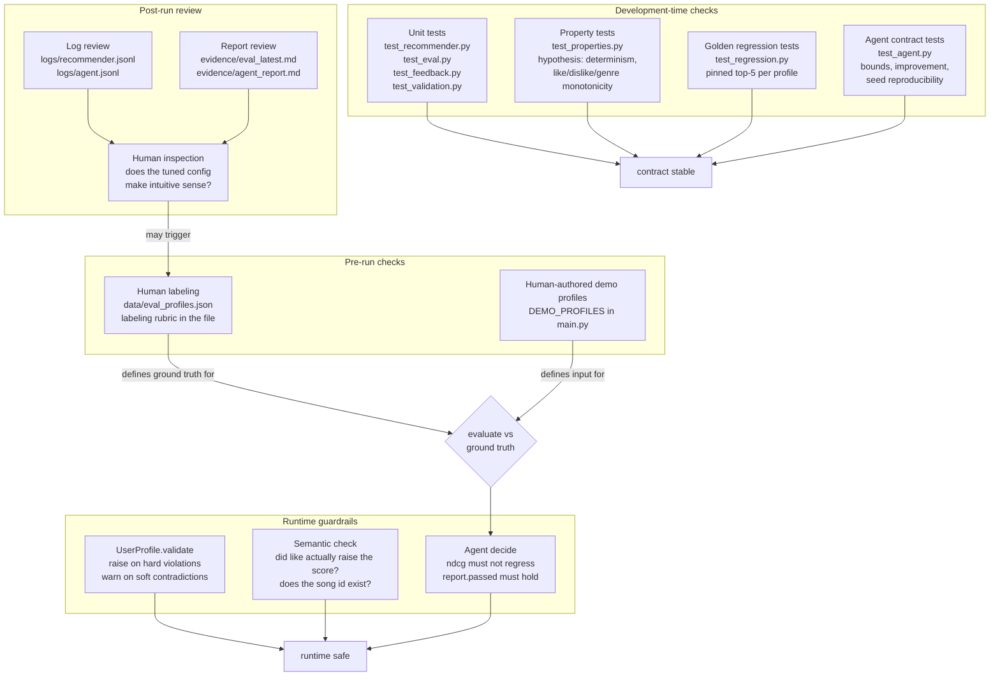

# UML/System Diagram for Music Matcher 1.1

This document presents three different diagrams in respective order:
1. The component-level UML
2. The end-to-end data flow from user input to ranked output
3. The points at which determine if people or the testing harness review and validate the AI

---

## 1. UML: Main Components

### Component groups

- **Core scorer:** `Recommender`, `Song`, `UserProfile`, `ScoringConfig`. Deterministic, pure, unchanged since Module 3 *except* that weights are now data.
- **Reliability / evaluator:** `Evaluator`, `EvalReport`, `Logger`, `UserProfile.validate()`. Produces quality numbers + a reject-or-warn guardrail at runtime.
- **Agent:** `WeightTuningAgent`, `Action`, `Step`. Plan / act / check / decide over `ScoringConfig`, using `Evaluator` as the objective.
- **Interface:** `MainCLI`, `FeedbackParser`. Three CLI modes; the interactive mode uses the same validate-then-check shape the agent uses.

---

## 2. Data Flow: Input -> Process -> Output

```mermaid
flowchart LR
    USER[User CLI input] --> DISPATCH{src/main.py<br/>argparse}
    DISPATCH -->|default| DEMO_PROFILE[Load 5 demo profiles<br/>from DEMO_PROFILES dict]
    DISPATCH -->|--tune| LOAD_TUNED[Load evidence/<br/>tuned_config.json]
    DISPATCH -->|--interactive| PARSE[FeedbackParser.parse_feedback]

    DEMO_PROFILE --> VALIDATE[UserProfile.validate]
    LOAD_TUNED --> VALIDATE
    PARSE --> APPLY[_apply_action]
    APPLY --> VALIDATE

    VALIDATE -->|raises ValueError| REJECT1[reject + log recommend_failed]
    VALIDATE -->|warn only| WARN[warnings list]
    VALIDATE --> SCORE[score_song + score_songs]
    WARN --> SCORE

    SCORE --> RANK[sort descending, take top-k]
    RANK --> LOG1[logs/recommender.jsonl<br/>profile_hash, top_ids, top_scores,<br/>warnings, latency]
    RANK --> SEM{semantic check<br/>interactive only}

    SEM -->|fails| REJECT2[reject + log<br/>interactive_rejected]
    SEM -->|passes| COMMIT[commit + log<br/>interactive_accepted]

    RANK --> OUT[Ranked top-k with<br/>scores + explanations]
    COMMIT --> OUT
    LOG1 --> OUT

    subgraph AGENT_LOOP[Agent loop -- src/agent.py]
      direction LR
      PLAN[plan] --> ACT[act<br/>apply delta + clamp]
      ACT --> CHECK[check = evaluate vs<br/>data/eval_profiles.json]
      CHECK --> DECIDE{decide:<br/>passed AND<br/>ndcg not worse?}
      DECIDE -->|yes| KEEP[keep candidate]
      DECIDE -->|no| ROLLBACK[rollback]
      KEEP --> NEXT[next iteration<br/>or patience stop]
      ROLLBACK --> NEXT
    end

    LOAD_TUNED -.produced by.-> AGENT_LOOP
    AGENT_LOOP --> LOG2[logs/agent.jsonl<br/>one line per step]
    AGENT_LOOP --> REPORT[evidence/agent_report.md<br/>trajectory + accepted actions]
```

**Reading left to right:** user input enters through `main.py`'s `argparse` dispatcher; gets routed to demo / tune / interactive flows; all flows share the same `validate → score → rank → log` spine. The agent loop is a separate subgraph that produces the tuned config consumed by `--tune`. Every arrow that crosses a module boundary corresponds to one JSONL log line on disk.

---

## 3: Where Humans and Test Automation check the AI

### Touchpoints by actor

- **Human: before the AI runs.** Writes the 5 demo profiles, writes the labels in `eval_profiles.json`, writes the labeling rubric. The AI can only be "good" relative to this human judgment.
- **Automated tests: before deploying.** 49 tests across 6 files. Unit tests pin the contract; property tests catch invariant violations; golden tests catch drift; agent tests pin bounds and reproducibility.
- **Runtime guardrails: while the AI is answering.** `validate()` is the bouncer at the door. The semantic check in interactive mode is the second bouncer inside. The agent's `decide` is the third bouncer for config changes.
- **Human: after the AI runs.** Review `evidence/agent_report.md` and `evidence/eval_latest.md` to judge whether the tuned config makes sense. If not, re-label the eval set and re-run. The loop closes at human inspection, by design.

**Rule of thumb:** no AI decision in this system goes un-checked by either a test, a guardrail, or a human-readable log. The pipeline is deliberately layered so any one layer failing is caught by the next.
