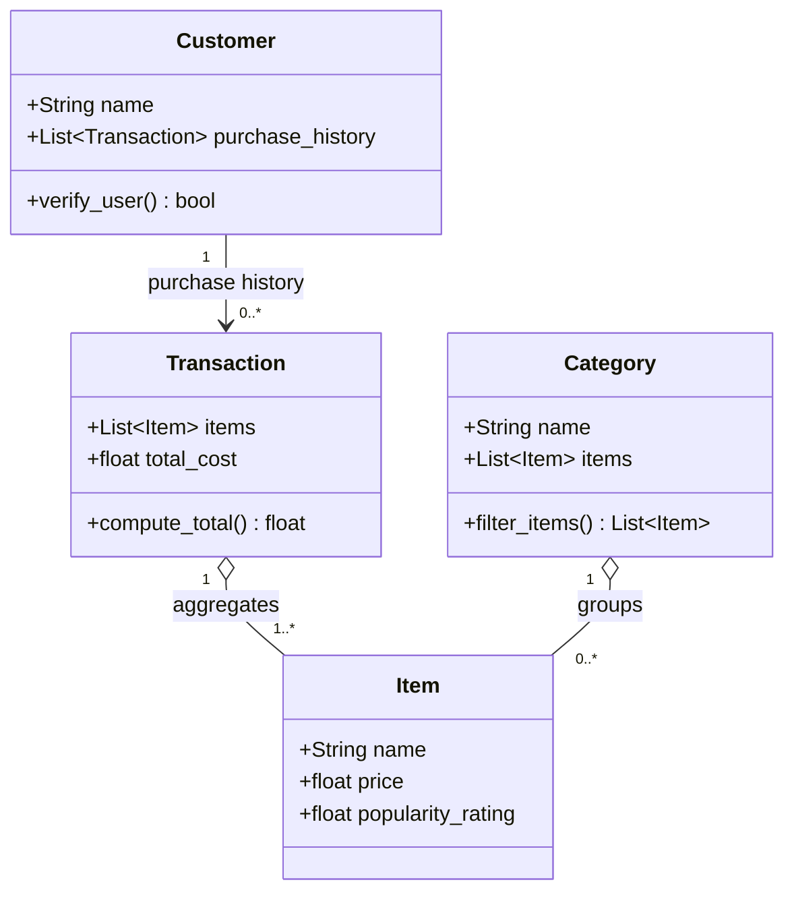

```mermaid
classDiagram
    class Customer {
        +String name
        +List~Transaction~ purchase_history
        +verify_user() bool
    }

    class Item {
        +String name
        +float price
        +float popularity_rating
    }

    class Transaction {
        +List~Item~ items
        +float total_cost
        +compute_total() float
    }

    class Category {
        +String name
        +List~Item~ items
        +filter_items() List~Item~
    }

    Customer "1" --> "0..*" Transaction : purchase history
    Transaction "1" o-- "1..*" Item : aggregates
    Category "1" o-- "0..*" Item : groups
```