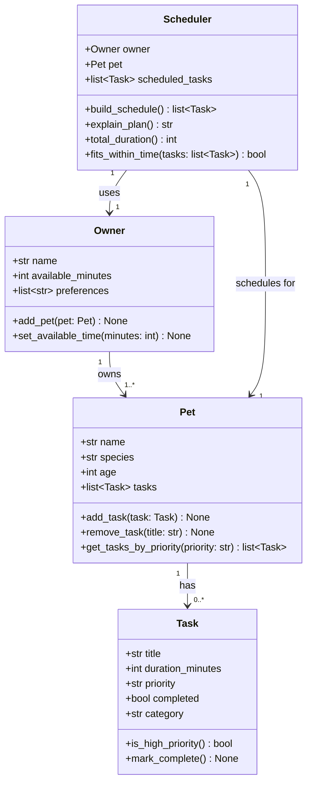

# PawPal+ Class Diagram

```mermaid
classDiagram
    class Owner {
        +str name
        +int available_minutes
        +list~str~ preferences
        +add_pet(pet: Pet) None
        +set_available_time(minutes: int) None
    }

    class Pet {
        +str name
        +str species
        +int age
        +list~Task~ tasks
        +add_task(task: Task) None
        +remove_task(title: str) None
        +get_tasks_by_priority(priority: str) list~Task~
    }

    class Task {
        +str title
        +int duration_minutes
        +str priority
        +bool completed
        +str category
        +is_high_priority() bool
        +mark_complete() None
    }

    class Scheduler {
        +Owner owner
        +Pet pet
        +list~Task~ scheduled_tasks
        +build_schedule() list~Task~
        +explain_plan() str
        +total_duration() int
        +fits_within_time(tasks: list~Task~) bool
    }

    Owner "1" --> "1..*" Pet : owns
    Pet "1" --> "0..*" Task : has
    Scheduler "1" --> "1" Owner : uses
    Scheduler "1" --> "1" Pet : schedules for
```
